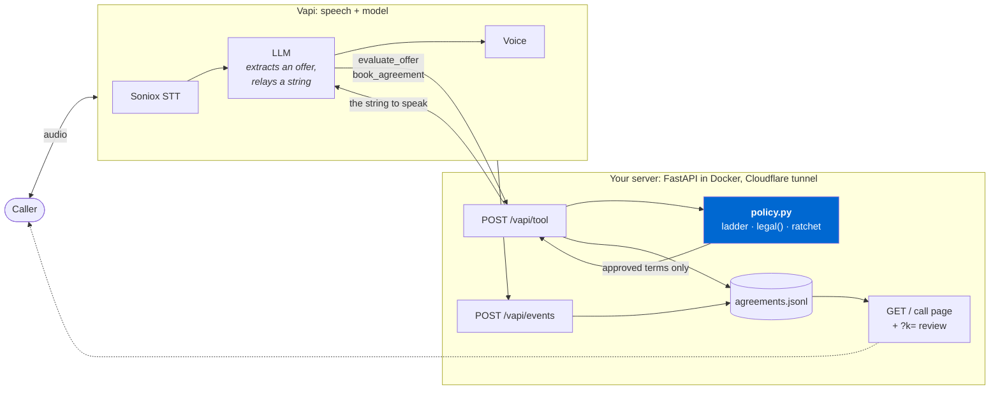

# Collections voice agent

Negotiates a $1,000 delinquent account. Every number it speaks comes from a policy service
outside the model. It cannot invent a discount, and cannot log a deal the validator refused.

- **Talk to it:** https://fed-tmp-improvement-defined.trycloudflare.com/
- **Call review:** append `?k=gGvndHZ1yoIqjvu-dh4NMA` for every call, the offers made, the
  validator's verdict for each, and the transcript
- **Recording:** _<link>_
- No phone number. The brief accepts a phone number or a web link; this is the web link.

## Three decisions

**1. The validator owns the ladder and the call state.** The obvious design gives the LLM a
valid/invalid tool and lets the prompt handle strategy. Under pressure the model finds the
discount itself. Here the server holds a rung index per call, descends one rung per counter,
and never climbs back. 20% off only exists at rung 3 of a list the model cannot see.

**2. Two gates.** `evaluate_offer` approves terms; `book_agreement` re-checks them against
policy *and* against what the validator issued on that call. A hallucinated "$400 and we're
even" can be spoken once, never booked.

**3. Compliance is code, not persuasion tuning.** The mini-Miranda is Vapi's `firstMessage`,
spoken verbatim, unparaphrasable. Threats, court, garnishment, credit claims and invented
deadlines are enumerated as forbidden sentences. Cease/dispute/attorney routes to a tool that
ends the call before any close. The end-of-call webhook regex-sweeps the transcript and flags
the record.

## Policy (`app/policy.py`)

| | |
|---|---|
| Balance | $1,000 |
| Settlement floor | $800 (20% max discount) |
| Minimum payment | 25% of the agreed total, so at most 4 payments |
| Settlement | 3 payments, 60 days |
| Plan | no discount, 4 payments, 90 days, weekly / biweekly / monthly |

| Rung | Offer |
|---|---|
| 0 | $1,000 today |
| 1 | $600 today + $400 in 14 days |
| 2 | Settle $950, 3 payments |
| 3 | Settle $900, 3 payments |
| 4 | Settle $850, 3 payments |
| 5 | Settle $800, 3 payments |
| 6 | Plan $1,000, 4 x $250, 90 days |

The maximum discount is five counters away, not two. A caller who repeats the same lowball
walks 5%, 10%, 15%, 20% before the agent runs out of authority.

Preference order, not dollar order: an $800 settlement outranks a $1,000 plan. A settled
account closes; a plan has three chances to break.

- **Ratchet.** One rung per counter, monotone, server-side.
- **Capacity-aware descent.** "$300 a month" gets the $900 settlement, not a pointless $1,000
  counter. Rungs are only skipped when capacity is *inferred* from an open-ended offer: a
  concrete figure is an anchor, not a demonstrated ceiling, so naming $800 outright still
  walks the whole ladder.
- **Lexicographic acceptance.** Accept if legal and `(total, -payments, -horizon)` beats our
  standing counter, so "$1,000 in two payments" is not rejected for being the wrong shape.

Three sub-floor offers triggers `hardship`: note it, close politely.

**On "25%":** the brief doesn't name a base. Read as 25% of the agreed total. Every tier also
clears 25% of the balance, so the ladder holds under either reading.

## Architecture



No dollar figure originates inside the Vapi box. `policy.py` is pure, so the negotiation is
testable without a voice stack.

```
app/policy.py              the negotiation. Pure functions, no deps
app/server.py              webhooks + serves the page
app/web/index.html         call page + gated review
agent/prompt.md            system prompt (source of truth)
agent/build_assistant.py   prompt + tools -> assistant.json
agent/deploy_assistant.py  push to Vapi (POST once, PATCH after)
agent/pull_assistant.py    pull dashboard changes back into code
agent/audit.py             fails if the agent spoke an unissued figure
tests/                     python -m tests.test_policy && python -m tests.test_server
```

## Run

```bash
cp .env.example .env       # fill in keys
docker compose up          # http://localhost:8080
```

Without any voice stack:

```bash
python -m tests.test_policy && python -m tests.test_server
curl -s localhost:8080/vapi/tool -H "Content-Type: application/json" -d @tests/sample_tool_call.json
```

Counters $900 in three payments.

## Deploy

Vapi needs a public HTTPS webhook. This runs on a NAS behind a Cloudflare tunnel, no ports
opened:

```bash
docker compose -f compose.nas.yaml up -d --build
echo "PUBLIC_HOST=https://your-url" >> .env
./sync.sh                  # code -> Vapi, prints what is live
```

`./sync.sh --pull` brings dashboard changes back into `build_assistant.py` (shows a diff,
waits for `y`). Commit them or the next `git pull` reverts them. Prompt, tools and webhook
URLs stay one-way.

| key | from | secret |
|---|---|---|
| `VAPI_PUBLIC_KEY` | Vapi, API Keys, public | no, ships in the browser |
| `VAPI_ASSISTANT_ID` | `deploy_assistant` output | no |
| `VAPI_API_KEY` | Vapi, API Keys, private | **yes** |
| `VAPI_SECRET` | random; sent as `x-vapi-secret` on both webhooks | **yes** |
| `REVIEW_KEY` | unlocks `/?k=`. Defaults to `VAPI_SECRET` | shareable |
| `PUBLIC_HOST` | your public URL | no |
| `VAPI_PHONE_NUMBER_ID` | outbound only, unused here | no |

**Model:** `MODEL` in `agent/build_assistant.py`. Pick for tool-calling reliability, not
intelligence: one that answers with a figure instead of calling `evaluate_offer` defeats the
design. After changing it, run `python -m agent.audit`.

## Tested

`tests/test_policy.py` covers properties over the whole offer space: every tier legal at every
cadence, nothing under $800, no payment under 25%, never more than 4 payments or 3 for a
settlement, never past 90 days, rung sequence monotone and stepping by one, cents exact.

`tests/test_server.py` covers real Vapi payloads: a hostile lowballer walked to a close, an
invented discount refused at booking, per-call state isolation, both tool-call payload shapes,
and empty/negative/absurd arguments that never 500 and never leak below the floor.

`python -m agent.audit` re-reads the log and fails if the agent ever spoke a figure the
validator did not issue. `tests/call-scripts.md` and `tests/adversarial.md` are the manual
passes.

## Limits

- Call state is in-process: dies on redeploy, assumes one replica.
- The compliance sweep is a regex: catches phrasing, not meaning.
- The ladder resets per call, so hanging up and calling back starts at full balance. No
  callback scheduling; retries would have to respect Reg F's 7-in-7 rule.
- No payment instrument is collected. Booking records an agreement, not a transaction.
